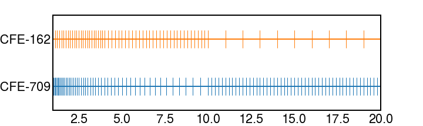

# FISPACT-II Energy Loss 
## Introduction
FISPACT-II is a point source transmutation and nuclear reaction code. Taking in cross-section data for a range of projectiles including neutrons, protons, deuterons, helium-3 and alpha.
In a charged particle irradiation the projectile will lose energy through the target. This must be accounted for using stopping power $\frac{dE}{dx}$ calculations. 

This project splits the calculation into a number of discrete components, one for each energy bin within the group structure. For charged particles the CCFE-162 group structure is used, while for neutrons the CCFE-709 group structure is used. 
The two group structures are whoen together below: 

The energy steps for the CCFE-162 group structure are: 

   - E>10MeV:        1MeV steps 
   - 4MeV<E<10MeV:   0.2MeV steps 
   - 1MeV<E<4MeV:    125keV steps
   - 300keV<E<1MeV:  25KeV steps
   - 100keV<E<300keV:20keV steps
   - 10keV<E<100keV: 5keV steps
   
The calculation takes into account the target thickness, breaking the target into discrete runs for each energy bin. Input files are sutomatically produced and FISPACT-II is run as a subprocess. Once the runs are complete, the individual runs are summed and parsed into a csv file containing the activity of each product over the irradiation time and cooling time.

## Running Calculations 
Examples can be found within the examples folder of this python package. 